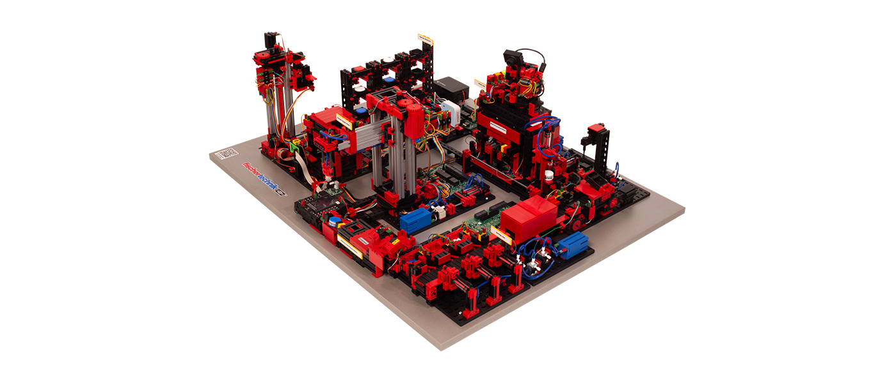
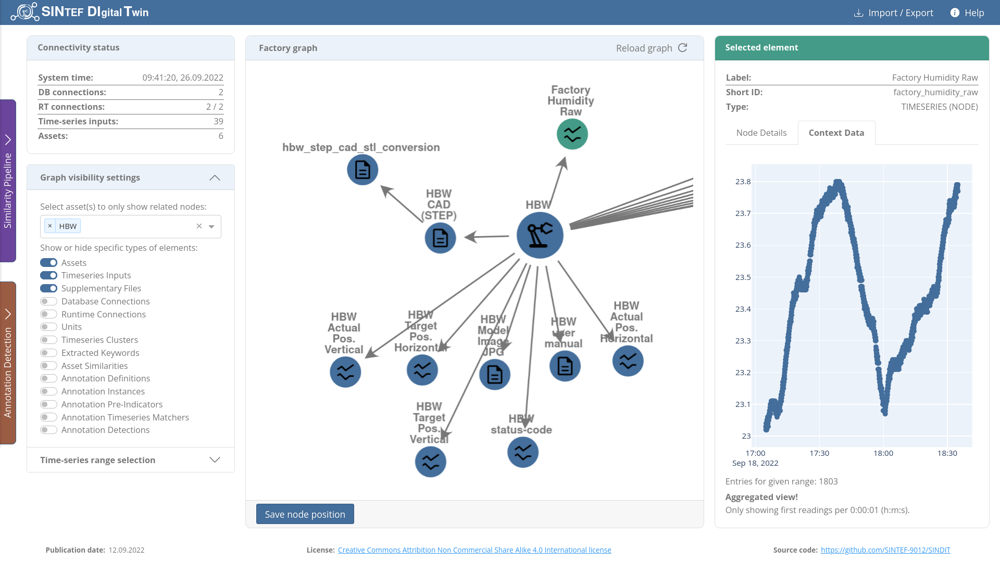

# SINDIT - SINTEF Digital Twin

## Public Demonstrator

A publicly accessible demonstration-instance of this work can be visited at:

[https://sindit.sintef.cloud](https://sindit.sintef.cloud)

## Description

### Demonstration Factory
For the demonstration of this project, we use a **fischertechnik © Training Factory Industry 4.0 24V**. 


> Image source: fischertechnik

This factory consists of multiple machines like a automated High-Bay-Warehouse and simulates a ordering- production- and delivery-process. It offers various time-series outputs that are available either via MQTT or OPC-UA. Most of those are included and utilized for this demonstrator.

The controllers of the factory also expose multiple interfaces. More details can be found [here](documentation/fischertechnik-training-factory-information.md).

Additional details about the factory can be found at [fischertechnik](https://www.fischertechnik.de/en/products/learning/training-models/554868-edu-training-factory-industry-4-0-24v-education#imagedownload).

### SINDIT Digital Twin Platform



The core of SINDIT is a universal Digital Twin platform, that holds all relevant information
about the assets from a connected factory and is synchronized in real-time to the
physical assets.

The Digital Twin serves as a contextualization layer connecting available data to provide a general
synopsis. 
The system contains both static information like documents, as well as dynamic time-series data.

Knowledge Graphs (KG) are a convenient method to represent structures of connected entities and allow efficient querying. For this reason, SINDIT utilizes such a KG as its main structure. 

To make the concept be applicable to various domains and factories, a very generic meta-model has been
created:


For specific data like time series or documents, specialized databases have been integrated. Connectors to commonly used messaging protocols like OPC UA and MQTT serve the real-time aspects of the digital twin.  

The graph-based Dashboard shown in the picture above serves as universal user interface and
visualizes both the structure and data of the assets, as well as interfaces to additional packages described below.

A REST-API is provided by the digital-twin service and is utilized by the dashboard-frontend. The following diagram provides an overview over the deployment architecture:


### Similarity Measures and Clustering

Overview over the implemented similarity-pipeline for generic, human-understandable comparisons between factory assets:


More information about the similarity measures will follow soon.

### Situation-related Knowledge Transfer and Domain Expert Annotations

Information about this package will follow soon.

## Installation, Requirements & How to Run

This project is set up using Docker and Docker-Compose. 

For developers, a Devcontainer-setup for Visual Studio Code is implemented. It can be used together with SSH remote development if needed.

Please take into account that the application with all its required database-systems has some increased memory requirements.

If you want to try SINDIT, please find the details on the requirements and how to develop or run SINDIT [here](documentation/sindit-development-guide.md).

That file also contains information about the exposed API and interfaces.

## FAQ

You can find answers to frequent questions [here](documentation/FAQ.md).  

## Historic Version of SINDIT

The original release of SINDIT was based on a fictive chocolate factory and has bee presented at the [ICSA22 conference](https://icsa-conferences.org/2022/conference-tracks/new-and-emerging-ideas/). The paper can be found [here](https://ieeexplore.ieee.org/document/9779654). Watch the presentation [here](https://www.youtube.com/watch?v=ExHNP6527d8&list=PLmMTZhDUcVmuFcJG9tbxR6AAWcOl2Jej3&index=29&t=2s).

You can find the source code of the old version under [Release v1.0.0](https://github.com/SINTEF-9012/SINDIT/releases/tag/v1.0.0).

## Blame & Contact

- Timo Peter [timo.peter@sintef.no](mailto:timo.peter@sintef.no)

- An Ngoc Lam [an.lam@sintef.no](mailto:an.lam@sintef.no)

---

This package is provided without any warranty.

# Launch command from Dev Container
```dotenv -f environment_and_configuration/devcontainer_environment_backend.env run python dt_backend.py```

```dotenv -f environment_and_configuration/devcontainer_environment_frontend.env run gunicorn dt_frontend:server -b :8050 --timeout 1800 --workers 4```
